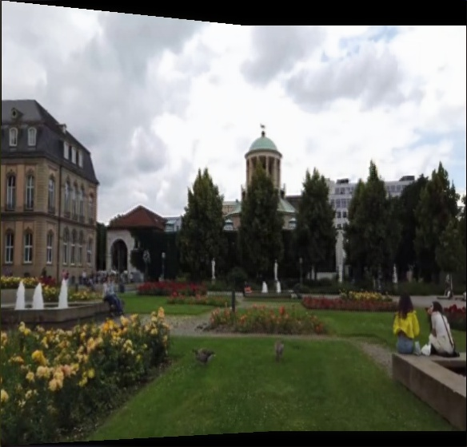
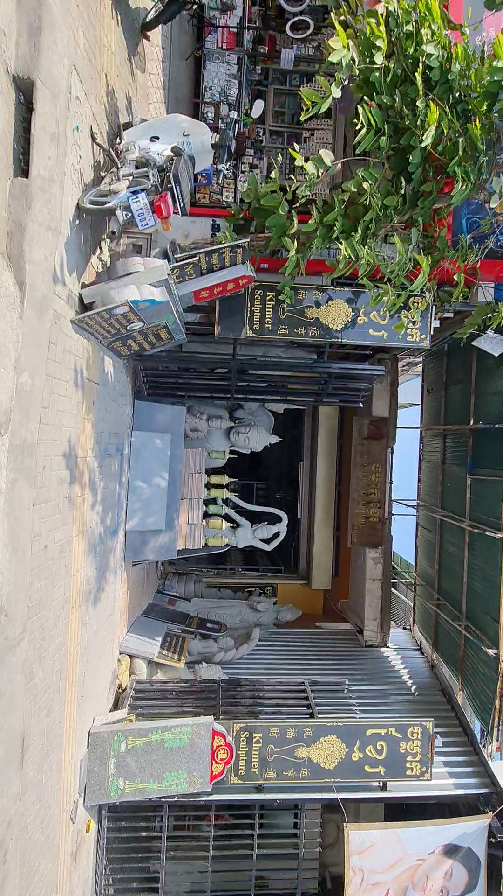
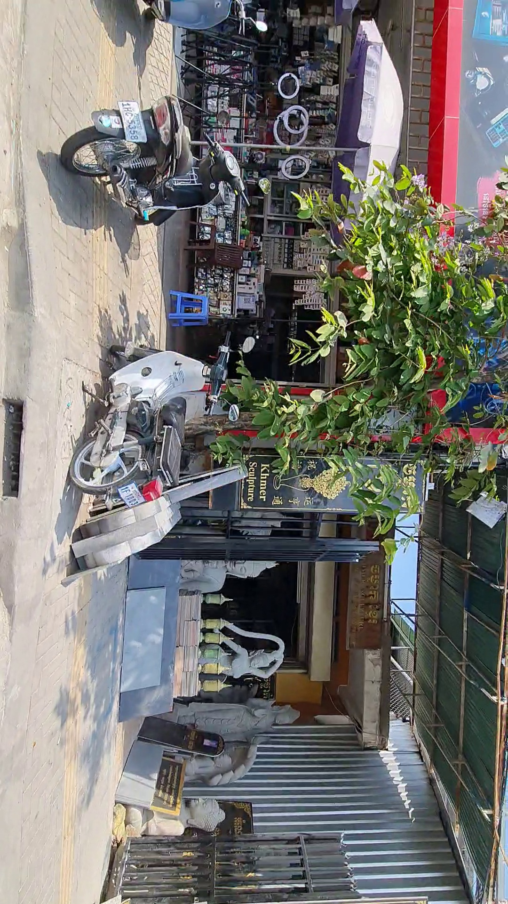

# Projects — Computer Vision Portfolio

**GitHub:** [Miodrag1234/Projects](https://github.com/Miodrag1234/Projects)

One repository for MSc / CV work: **panorama stitching**, **homography estimation**, and **depth estimation**, plus a small **IoT** demo. Each topic lives in its own folder with code, docs, and sample outputs (no large datasets or weights on GitHub).

---

## Projects

| Folder | Topic | Status | Quick link |
|--------|--------|--------|------------|
| [**panorama-stitching/**](panorama-stitching/) | Deep panoramic stitching (UDIS, Net4, FERIT-Panorama26) | **Done** — code, metrics, sample panorama | [README](panorama-stitching/README.md) · [results](panorama-stitching/docs/RESULTS.md) |
| [**homography-estimation/**](homography-estimation/) | SIFT / SuperPoint + LightGlue, FERIT-HOMOGRAPHY, benchmarks | **Done** — scripts, eval, docs | [README](homography-estimation/README.md) · [experiments](homography-estimation/docs/EXPERIMENT_SUMMARY.md) |
| [**depth-estimation/**](depth-estimation/) | Stereo depth (Selective-IGEV backbones, KITTI, Ferit-Depth26) | **Done** — scripts, EPE/D1 tables | [README](depth-estimation/README.md) · [results](depth-estimation/rezultati_evaluacije/) |
| [**smart-kitchen/**](smart-kitchen/) | IoT kitchen: MQTT, Arduino, SCADA | **Done** — firmware + Python daemons | [README](smart-kitchen/README.md) |

---

## Highlights for recruiters

- **Panorama:** end-to-end TF 1.x pipeline, custom Net4 architecture experiments, PSNR/SSIM + multi-resolution robustness, custom Mapillary dataset (documented).
- **Homography:** Glue Factory extensions — custom dataset tooling, homography eval, descriptor refiner, HPatches / MegaDepth / ScanNet mAA tables, match & homography visualizations.
- **Depth:** Selective-IGEV with swappable CNN extractors; KITTI 2015 best EPE 0.303 / D1 1.4% (MobileNetV3); Ferit-Depth26 comparison vs MobileNetV2 baseline.

---

## Sample outputs

**Stitched panorama (UDIS-V1, Stage 2):**



**Input pair — FERIT-Panorama26 samples** ([Mapillary](https://www.mapillary.com/), consecutive frames):

| Frame | Frame |
|-------|-------|
|  |  |

More samples: [panorama-stitching/datasets/FERIT-Panorama26/samples/](panorama-stitching/datasets/FERIT-Panorama26/samples/)

---

## Repository layout

```
Projects/                          ← this repo (root)
├── README.md                      ← you are here
├── panorama-stitching/
├── homography-estimation/         ← Glue Factory extensions (this project)
├── depth-estimation/           ← Selective-IGEV adapters, eval, results
└── smart-kitchen/              ← MQTT / Arduino IoT demo
```

---

## Clone & update

```bash
git clone https://github.com/Miodrag1234/Projects.git
cd Projects
```

After changes:

```bash
git add -A
git commit -m "Update homography-estimation"
git push
```

Guide: [panorama-stitching/docs/PUSH_TO_GITHUB.md](panorama-stitching/docs/PUSH_TO_GITHUB.md)

---

## Tech stack (overall)

Python · TensorFlow 1.x / PyTorch (per project) · OpenCV · NumPy · Computer Vision · Deep Learning

---

## Contact

**Miodrag** · *[your email]* · *[LinkedIn]*
