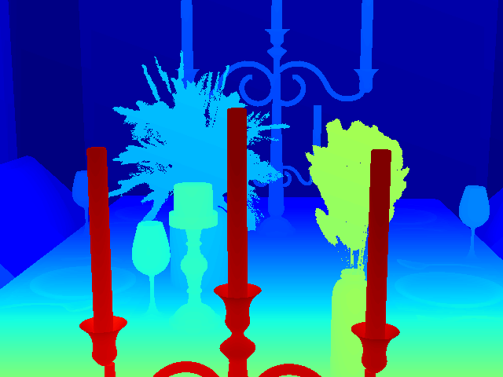

# Ferit-Depth26 — layout (examples only)

Custom Blender stereo set used for training/eval. **The full dataset is not in this repository** (size + no need for a CV repo). This folder documents the format and a **single-scene placeholder**.

## Specs

| | |
|---|---|
| Resolution | 640 × 480 |
| RGB | PNG (`left_XXX.png`, `right_XXX.png`) |
| Ground truth | PFM disparity in pixels (`disp_XXX.pfm`), not metric depth |
| Loader | `SyntheticStereoTestDataset` in `core/stereo_datasets.py` |

## Folder layout

```text
synt_test_dataset/          # --synt_root
  scene01/
    left/left_000.png
    right/right_000.png
    dispgt/disp_000.pfm
  scene02/
    ...
```

Point eval/train at that root:

```powershell
python evaluate_stereo.py --dataset synthetic --synt_root "datasets/synt_test_dataset" ...
python train_stereo.py --train_datasets synthetic_train --synt_root "datasets/synt_test_dataset" ...
```

If disparity sign/order is wrong (very high EPE), try `--synt_disp_sign -1` and/or `--synt_swap_lr`.

## Sample pair (`scene01`, frame 038)

| Left | Right | Disparity GT (preview) |
|---|---|---|
|  |  |  |

```text
examples/ferit-depth26/scene01/
  left/left_038.png
  right/right_038.png
  dispgt/disp_038_preview.png
```

One pair only — not the full training set. The PNG is a colorized disparity preview (near = red/yellow, far = blue).

## Depth from disparity

\[
Z = \frac{f_x \cdot B}{d}
\]

with \(d\) in pixels. Metrics in this project (EPE, D1) are on disparity, as in KITTI stereo.
