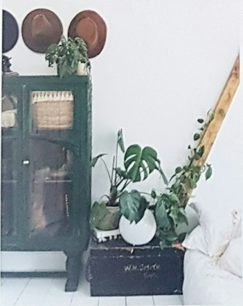

# FERIT-HOMOGRAPHY (documentation + one example pair)

Custom homography dataset for **full scene ↔ local patch** matching.  
The **full dataset is not hosted on GitHub** (size and usage rights). This folder documents the format and includes **one illustrative scene** so reviewers can see how pairs are defined.

---

## Task

Each sample is an image pair:

- **View 0** — full scene (`original.jpg` or equivalent)
- **View 1** — cropped patch from the same scene
- **Ground truth** — planar homography **H** mapping coordinates from view 0 to view 1 (scene → crop)

Used for fine-tuning and evaluating **SIFT + LightGlue** with Glue Factory’s `image_pairs` dataset and `homography_matcher` supervision.

---

## Example pair (included in this repo)

**Scene 1 — desk / magazine layout.** The patch region is marked on the scene image; the patch file is the warped crop used as view 1.

| Role | File | Description |
|------|------|-------------|
| View 0 (scene + annotation) | [`scene1_final_annotated.png`](scene1_final_annotated.png) | Full scene; quadrilateral **`patch_01`** with corners **1–4** defines the region |
| View 1 (patch) | [`scene1_patch_01.png`](scene1_patch_01.png) | Cropped patch aligned to that quadrilateral |




In the full dataset, each scene folder also stores `*_H_scene_to_crop.txt` (3×3 **H**) and JSON metadata; see layout below.

---

## Statistics (full collection)

| Split | Scenes | Pairs | List file |
|-------|:------:|:-----:|-----------|
| Train | 419 | 884 | `pairs_train.txt` |
| Val | 46 | 94 | `pairs_val.txt` |
| Test | separate hold-out | (project-specific) | `pairs_test.txt` |
| **Total (train+val)** | **465** | **978** | — |

Test scenes are kept in a **separate folder** from training; pair files are generated with the same script (`--test-only`).

---

## Folder layout (one scene)

```
scene042/
  original.jpg
  scene042_patch_03.png
  scene042_patch_03_H_scene_to_crop.txt
  scene042_patch_03.json          # metadata (patch index, file names, …)
  scene042_patch_04.png
  ...
```

- **`H_scene_to_crop.txt`** — 3×3 homography (row-major), maps **scene (view 0) → crop (view 1)**.
- **JSON** — references `crop_file`, `homography_scene_to_crop_file`, etc. (used by `generate_cropped_pairs.py`).

---

## Example pair line (`pairs_train.txt`)

Glue Factory `image_pairs` format with `extra_data: homography`:

```
<image0> <image1> H11 H12 H13 H21 H22 H23 H31 H32 H33
```

Illustrative paths for scene 1 (homography values come from your local `H_scene_to_crop.txt`):

```
scene1/original.jpg scene1/scene1_patch_01.png ...
```

See also: [`example_pair_line.txt`](example_pair_line.txt).

---

## How pairs are generated

From the repository root (with your local copy of scenes under `data/cropped_output/`):

```bash
python -m gluefactory.scripts.generate_cropped_pairs --root data/cropped_output
python -m gluefactory.scripts.generate_cropped_pairs --root data/my_test_set --test-only
```

This writes `pairs_train.txt`, `pairs_val.txt`, and optionally `pairs_test.txt` under the dataset root.

---

## Training / evaluation in this project

| Step | Config / module |
|------|-----------------|
| Train on FERIT | `gluefactory/configs/sift+lightglue_cropped_homography.yaml` |
| Train + refiner | `gluefactory/configs/sift+lightglue_refiner_cropped_homography.yaml` |
| Eval (homography mAA) | `python -m gluefactory.eval.ferit_homography ...` |

Preprocessing (eval): resize long side 1024, `square_pad: true`, OpenCV homography estimator, `ransac_th: 0.5`.

---

## Citation / usage

Dataset collected for academic work at FERIT. Do not redistribute the full image collection without permission. The single example pair here is for portfolio / thesis illustration. Code in this repo for handling the format is under the same **Apache-2.0** license as Glue Factory.
